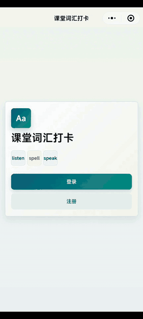
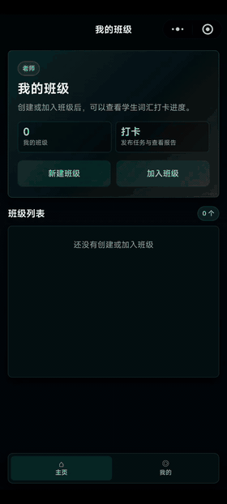
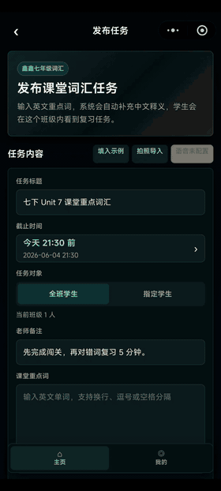
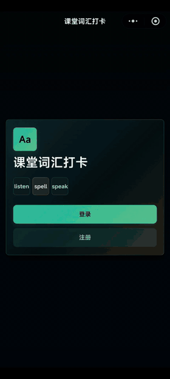
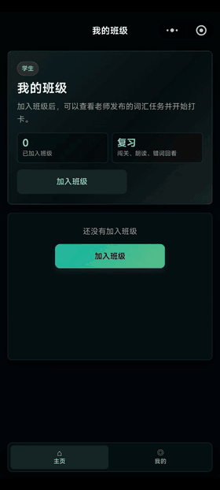
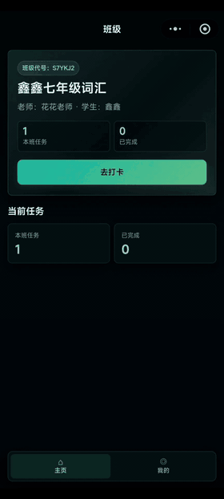

# EnglishAssist

EnglishAssist 是一个面向英语课堂词汇复习场景的微信小程序。老师可以发布课堂重点词任务，学生完成闯关练习后，系统自动记录成绩、错词和完成情况，方便老师快速查看学习反馈。

## 功能概览

- 老师端
  - 创建和管理班级
  - 发布词汇练习任务
  - 批量录入单词和中文释义
  - 查看学生完成情况、分数、耗时和错词
  - 汇总班级任务报告

- 学生端
  - 加入班级并查看学习任务
  - 完成选择题、拼写题等词汇练习
  - 查看练习结果、分数和错词
  - 通过个人页面查看学习记录

- 练习能力
  - 支持本地词库匹配
  - 支持录音答题入口
  - 预留云函数能力，用于词义查询和语音识别

## 演示视频

以下预览展示了老师端和学生端的主要使用流程，点击预览可查看原视频。

<table>
  <tr>
    <td align="center">
      
       
      <strong>老师注册</strong>
    </td>
    <td align="center">
      
       
      <strong>老师创建班级</strong>
    </td>
    <td align="center">
      
       
      <strong>老师发布任务</strong>
    </td>
  </tr>
  <tr>
    <td align="center">
      
       
      <strong>学生注册</strong>
    </td>
    <td align="center">
      
       
      <strong>学生加入班级</strong>
    </td>
    <td align="center">
      
       
      <strong>学生完成任务</strong>
    </td>
  </tr>
</table>

## 项目结构

- `pages/`：小程序页面
- `components/`：公共组件
- `utils/`：本地数据、主题、音频和云服务工具
- `cloudfunctions/`：云函数
- `app.js` / `app.json` / `app.wxss`：小程序全局配置
- `project.config.json`：微信开发者工具项目配置
